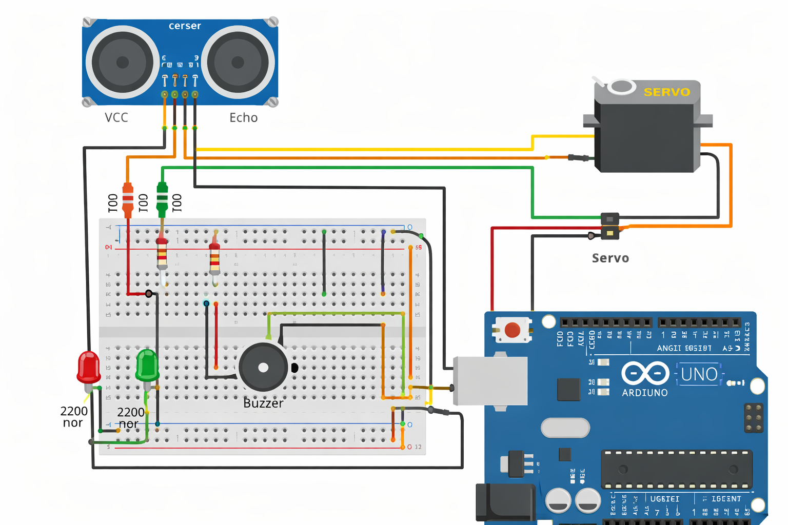
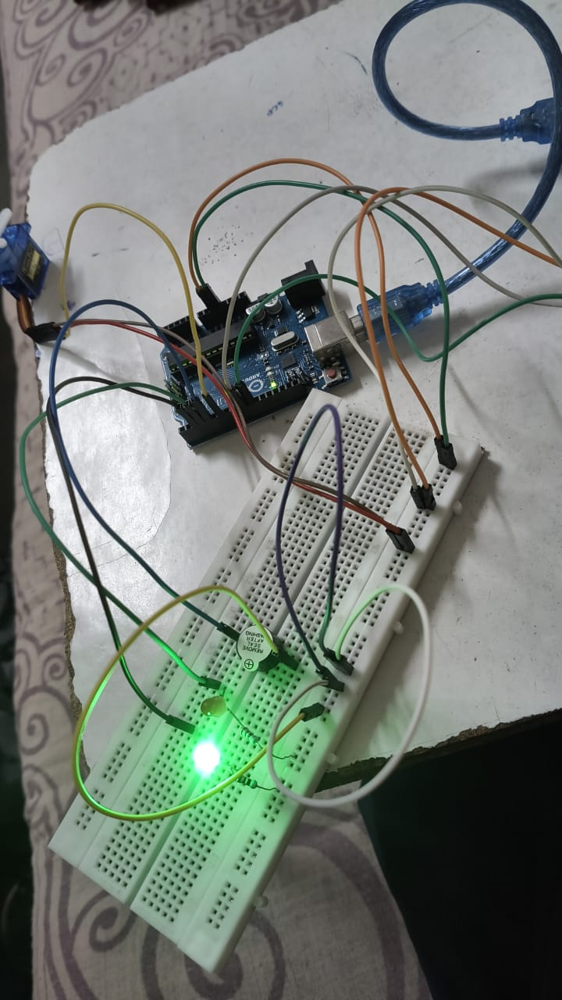

# 🚀 Obstacle Detection and Tracking System

## 📌 Overview
This project is an Arduino Uno-based obstacle detection and tracking system using an ultrasonic sensor and a servo motor. It detects objects, tracks them, and provides alerts using LEDs and a buzzer.

---

## 🛠️ Components Used
- Arduino Uno  
- Ultrasonic Sensor (HC-SR04)  
- Servo Motor (SG90)  
- Buzzer  
- LEDs (Red & Green)  
- Resistors  
- Breadboard & Jumper Wires  

---

## ⚙️ Working
- The ultrasonic sensor measures the distance of nearby objects.  
- If an obstacle is detected within a certain range, the servo motor rotates to track it.  
- Red LED and buzzer indicate obstacle detection.  
- Green LED indicates no obstacle.  

---

## ✨ Features
- Real-time obstacle detection  
- Servo-based scanning (radar-like system)  
- LED and buzzer alert system  
- Simple and low-cost design  

---

## 🔌 Circuit Diagram

---

## 📸 Project Setup

---

## 🎥 Working Demo
👉 [Watch Video](https://drive.google.com/file/d/1LLrxssoqVm3YYxh3ZLr4v7bT5ghL2Jck/view?usp=drive_link)

---

## 💻 Code
Available in this repository:  
`Obstacle_Tracking_System.ino`

---

## 🚀 Future Improvements
- Add LCD display for distance measurement  
- Integrate IoT for remote monitoring  
- Improve accuracy using advanced sensors  

---

## 👩‍💻 Author
Sakshi Patil
